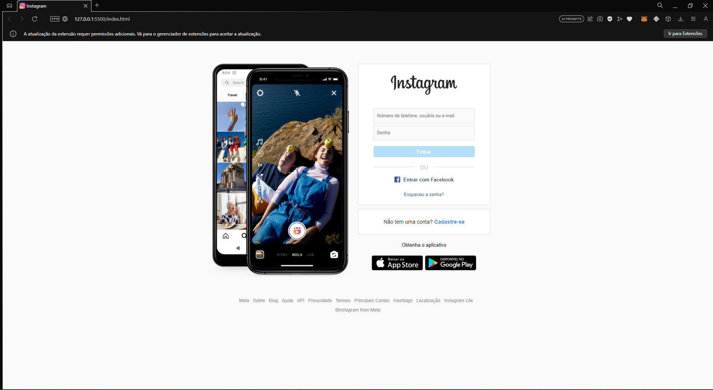
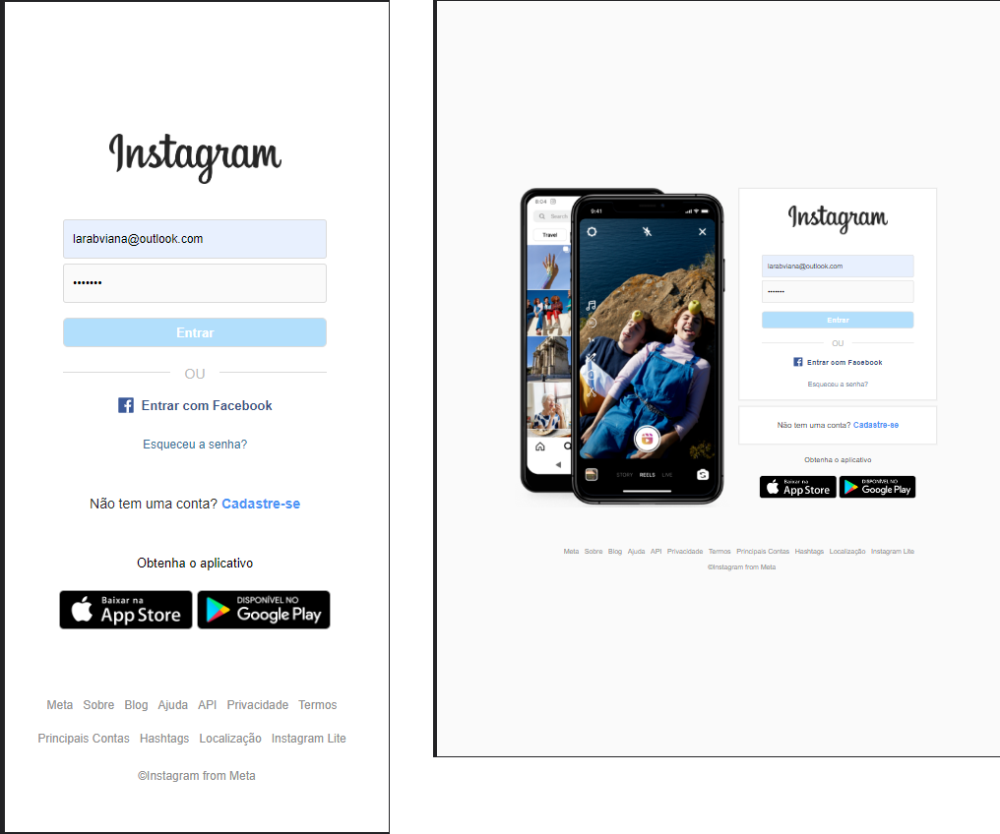

<h1 align="center"> Log in Instragram Account</h1>

Página clone do Log in do Instagram   

  <a href="#-tecnologias">Techs/Tecnologias</a>&nbsp;&nbsp;&nbsp;|&nbsp;&nbsp;&nbsp;
  <a href="#-projeto">Project/Projeto</a>&nbsp;&nbsp;&nbsp;|&nbsp;&nbsp;&nbsp;
  <a href="#-layout">Layout</a>&nbsp;&nbsp;&nbsp;|&nbsp;&nbsp;&nbsp;
  <a href="#memo-licença">License/Licença</a>

  

  

## 🚀 Techs / Tecnologias

Esse projeto foi desenvolvido com as seguintes tecnologias:

- HTML e CSS
- JavaScript
- Git e Github

## 💻 Project / Projeto

Este projeto foi a realização de uma página clone do Instagram, ele fará parte de um projeto de páginas clones de redes-sociais que quero estar trazendo ao meu portfólio. Nele temos responsividade em aparelhos com telas até 450px e também telas até 1100px como iPads e Tablets. 

## 🔖 Layout

Você pode visualizar o layout do projeto através do repositório. 
